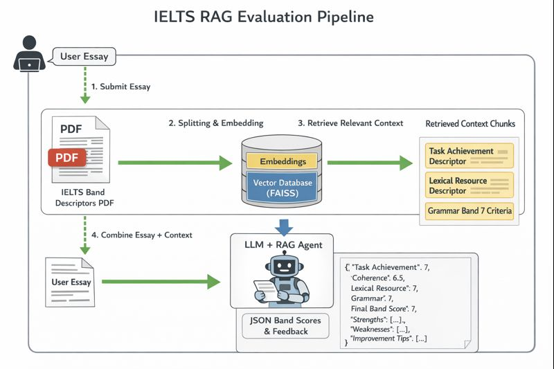

# 📘 IELTS Writing Evaluator with RAG (Streamlit)

## 📝 Project Overview

### 6️⃣ Team Members
- Ahmad Zeidan
- Doaa AbuJayyab
- Sami Moqbel

### 6️⃣ Run Commands

- pip install -r requirements.txt
- python -m streamlit run app.py --server.port 8501 --server.address 0.0.0.0

### Project Name
**Agentic IELTS Writing Evaluator Application**

### Description
This project is a **Agentic CrewAI, Streamlit-based AI application** that evaluates **IELTS Writing Task essays** using **Retrieval-Augmented Generation (RAG)** grounded in **official IELTS band descriptor PDFs**.

Users submit an IELTS writing essay and receive a **structured IELTS-style evaluation**, including:
- Band score per criterion  
- Overall band score  
- Confidence score per band  
- Strengths  
- Weaknesses  
- Actionable improvement tips  

By retrieving relevant rubric information directly from **official IELTS band descriptors**, the system ensures evaluations are **transparent, explainable, and aligned with IELTS standards**.

---

## 🎯 How Does It Benefit End Users?

### 👩‍🎓 IELTS Candidates
- Instant IELTS-style writing feedback  
- Clear explanation of why a specific band was assigned  
- Actionable tips to improve band score  
- Confidence indicator for score reliability  
- Unlimited practice without additional cost  

### 📚 Self-Learners
- Structured feedback instead of generic comments  
- Better understanding of IELTS scoring criteria  
- Practice-oriented learning experience  

---

## 🏢 Business & Organizational Benefits

### For EdTech Platforms
- Automated essay evaluation at scale  
- Reduced dependency on human examiners  
- Faster feedback cycles  
- Easy integration with online learning systems  

### For IELTS Training Centers
- Consistent and unbiased evaluation  
- Reduced instructor workload  
- Improved learner engagement  
- Data-driven performance analysis  

---

## 🧠 Technical Architecture

### IELTS RAG Evaluation Pipeline

---

## ⚙️ System Components

### 1️⃣ Streamlit UI
- Web-based interface
- Accepts IELTS essay input
- Displays structured evaluation results

### 2️⃣ IELTS Band Descriptor PDFs
- Official public IELTS band descriptors
- Used as authoritative evaluation criteria
- Converted into searchable knowledge chunks

### 3️⃣ Retrieval-Augmented Generation (RAG)
- Retrieves relevant rubric sections
- Injects them into LLM prompts
- Reduces hallucination and subjectivity

### 4️⃣ Embedding Model
- Sentence-Transformers (MiniLM)
- Converts text into dense vector embeddings

### 5️⃣ Vector Database
- FAISS (local vector storage)
- Enables fast semantic similarity search

### 6️⃣ Large Language Model (LLM)
- Generates IELTS-style feedback
- Produces structured JSON output
- Uses retrieved rubric context

---

